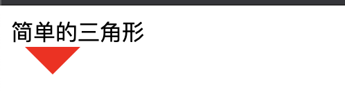

# 前言

> 开发中经常能遇到小三角的需求，虽然大概率设计会给一张花里胡哨的三角图标，但是遇到简单的小三角我们完全可以不用图片，只用css来实现，会在一定程度上提高前端性能，这篇博文主要是总结一些开发中可以用css样式实现的布局。

## css画各个方向的三角形

三角形效果的实现主要用到了盒子的border属性
```css
.box {
    width: 0;
    height: 0;
    border-top: 20px solid red;
    border-right: 20px solid transparent;
    border-left: 20px solid transparent;
    border-bottom: 20px solid transparent;
}
```
效果如下：



## text内容超出部分"..."

> 大部分项目里面都会有文本超出区域的情况，一般都会要加三个点隐藏多余部分，之前开发好多次都是直接网上搜这几行代码，然后复制粘贴，效率也不低，但还是自己记住更快一些

```css
.textBox {
        width: 20px;
        overflow:hidden;
        word-break:keep-all;
        white-space:nowrap;
        text-overflow:ellipsis;
    }
```
  
