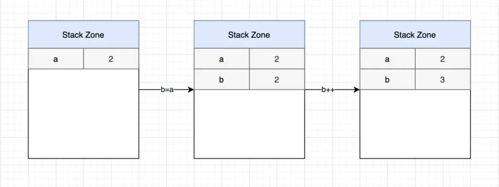
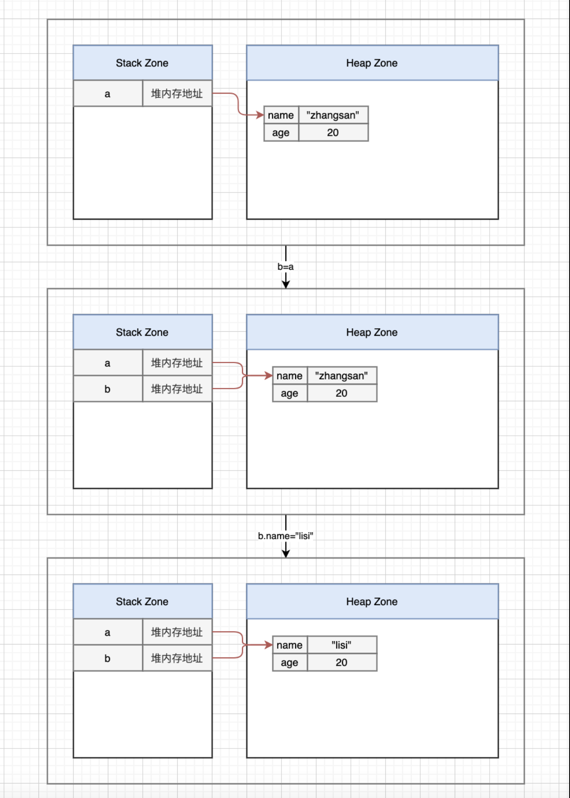

## 前言
> javascript中变量所持有的值可分为两种：值类型和引用类型。
> + 值类型：主要是指**基本类型**，即`number`，`string`，`boolean`，`undefined`，`null`，`symbol`。它们总是通过**值复制**的方式赋值和传递值。
> + 引用类型：除上述值类型外的**对象类型**。它们总是通过引用复制的方式赋值和传递值，`Object`、`Array`、`RegExp`、`Date`、`Function`。

## 值类型
值类型的数据是不可变的，在内存中占有固定大小的空间，它们都会被存储在**栈**（stack）中。
值类型的存储过程如下：

a所持有的值是值类型，所以当执行b = a时，b会持有2的一个副本。所以b改变时，**a并未受到影响**。a和b所持有的值`相互独立`。
+ 如果使用构造函数声明一个基本类型，并改变它,举个例子:
```js
let a = new Number(10);
let b = a;
b++;
console.log(a); // Number {[[PrimitiveValue]]: 10}
console.log(b); // 11
```
实际上，因为a是通过构造函数声明的，所以它所持有的值是引用类型，所以在第二步let b = a时，b和a指向同一个引用。
但是第三步中b++（等价于b = b + 1），在执行b + 1时，进行了`隐式拆箱`，将b从Number对象提取为基本类型10，所以最后b的值变成了11，而a的值并未受到影响。
## 引用类型
引用类型的数据大小不固定，所以把它们的值存在`堆`（Heap）中，但还是会把它们在堆中的内存地址存在栈中。在查询引用类型数据时，`先从栈中读取所持有的数据在堆中的内存地址`，然后根据地址找到实际的数据。
```js
const a = { name: "zhangsan", age: 20 };
const b = a;

b.name = "lisi";
console.log(a); // {name:"lisi", age:20}
console.log(b); // {name:"lisi", age:20}
```
**在扩展运算符的影响下，b的改变不会影响a**
```js
const a = { name: "zhangsan", age: 20 };
const b = {...a};

b.name = "lisi";
console.log(a); // { name: "zhangsan", age: 20 }
console.log(b); // {name:"lisi", age:20}
```
上述代码的存储过程如下图：

## 两种类型的区别
1. 存储
    + 基本类型的值是存放在**栈区**的，即内存中的`栈内存`
    + 引用类型的值是同时保存在**栈内存和堆内存**的
2. 访问
    + 基本类型的值是**按值访问**的，因为可以操作保存在变量中的实际的值。
    + 引用类型的值是**按引用访问**的，因为引用类型的值是保存在内存中的对象，而与其他语言不同的是，**JavaScript 不允许直接访问内存中的位置**，即不可以直接操作对象的内存空间，那么，在操作对象时，实际上是在操作对象的引用而不是实际的对象。
3. 动态的属性
    + 对于引用类型的值，很明显，我们可以为其 添加、改变、删除 属性和方法。
    + 但是，我们不可以给基本类型的值添加方法和属性
4. 比较

    关于值的比较
    + 值类型
    ```js
    var a = 1;
    var b = true;
    console.log(a == b);    //true
    ```
    + 引用类型
    ```js
    var person1 = {};
    var person2 = {};
    console.log(person1 == person2);    //false
    ```
5. 复制变量值
    + 值类型复制出来的变量值是和原来的变量值互不影响的
    + 那么，复制引用类型的值时，同样也会将一份存储在对象中的值复制到新变量的空间中，不同的是，这个值的副本实际上是一个 指针，指向的是存储在堆中的对象。也就是说，复制结束后，这两个变量将引用同一个对象。
6. 传递参数
    + 需要注意的是，尽管在访问变量时有着按值访问和按引用访问这两种方式，但 ECMAScript 中所有的函数的参数都是按值传递的，即**参数只能按值传递**，也就是说，把函数外部的值复制给函数内部的参数，就类似于变量之间的值复制一样。
    + 但是向参数传递引用类型的值时，复制给局部变量的是**内存中的地址**，因此这个局部变量的变化会被反映在函数的外部。
    ```js
    function setName(obj){
          obj.name = "Ozzie";
    }
    var person = new Object();
    setName(person);
    console.log(person.name);    //"Ozzie"
    ```
   **这里很容易误认为参数是按引用传递的，因为在局部作用域中修改的参数会在全局作用域中反映出来，OK，那么我们再看一个例子：**
   ```js
    function setName(obj){
          obj.name = "Ozzie";
          obj = new Object();
          obj.name = "Nicholas"
    }
    var person = new Object();
    setName(person);
    console.log(person.name);    //Ozzie
    ```
   如果是按引用传递参数的，那么显然 person 对象就会在函数内部自动修改 name 属性为 Nicholas，但结果仍然是 Ozzie，这说明，即使在函数内部修改了参数的值，但原始的引用仍然保持不变，实际上，在函数内部重写 obj 时，这个变量的引用就是一个局部对象了，而这个局部对象在函数执行完毕后立即被销毁。
      

## 参考
掘金：[仲春十一](https://juejin.im/post/6844904198484541454)

learnku: [Ozzie](https://learnku.com/articles/38192)
