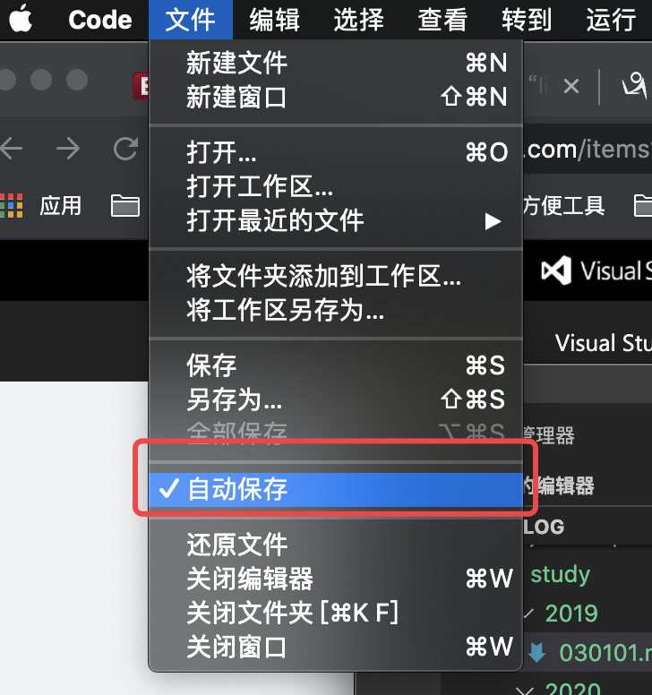
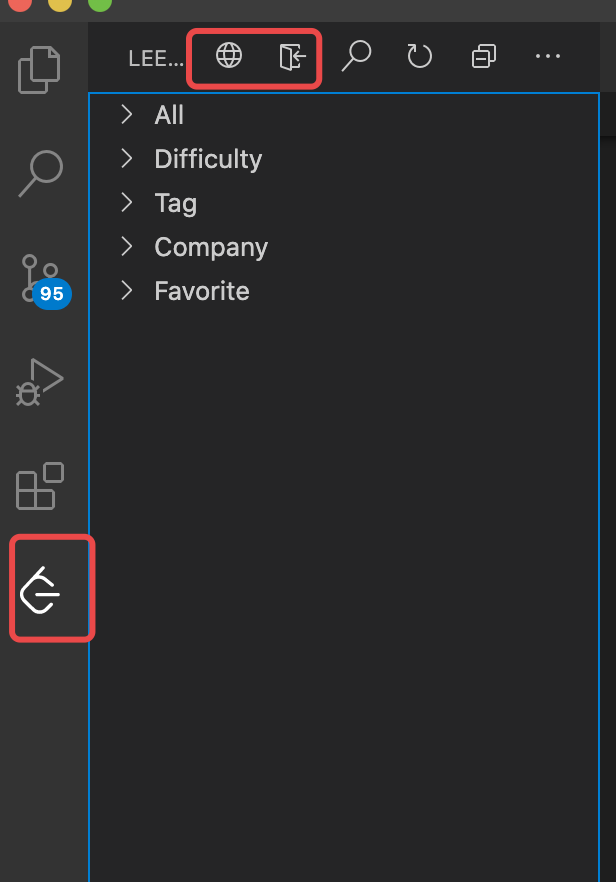

## 前言

> 记录一下使用vscode这一个轻便小巧的编辑器历程，介绍实用的设置以及插件。

## 编辑器设置

### 自动保存

mac电脑是直接可以选择默认保存，windows系统的电脑还得去偏好设置里面去搜索**autoSave**。。。。怎么说呢，感觉用了macbook之后自己的效率提高了不少。

## 插件

### 中文插件

这个插件对英文不好的我真是太友好了，安装完之后编辑器的工具栏，任务栏都变成中文的，但是如果你想锻炼一下你的英文识别能力，可以不用安装这个插件。不过安装完之后工作，视觉疲劳减轻了很多。

关键字： **Chinese**

### LeetCode

这个插件我安装的初衷是能在项目不忙我没事干的时候刷刷题，而且还不会被领导发现，直接在左边插件市场里面搜索`LeetCode`安装就行。不过我当时安装完登陆的时候发现一直报`Error: certificate has expired`的错误，登陆失败，后来google一下发现原来是**node版本过低的原因**，说起node版本我就很迷，之前在下载了nvm（**node版本管理工具**）之后每次重启电脑或者重新打开编辑器的时候node版本都不是最新的，今天才发现，我一直把8.17.0设置为默认版本。。。。顺便说一下nvm更改默认版本的命令`nvm alias default v4.3.0`。话又说回来，改完node版本之后重启一下vscode，然后重新登录就能成功了。

关键字： **LeetCode**

### 

