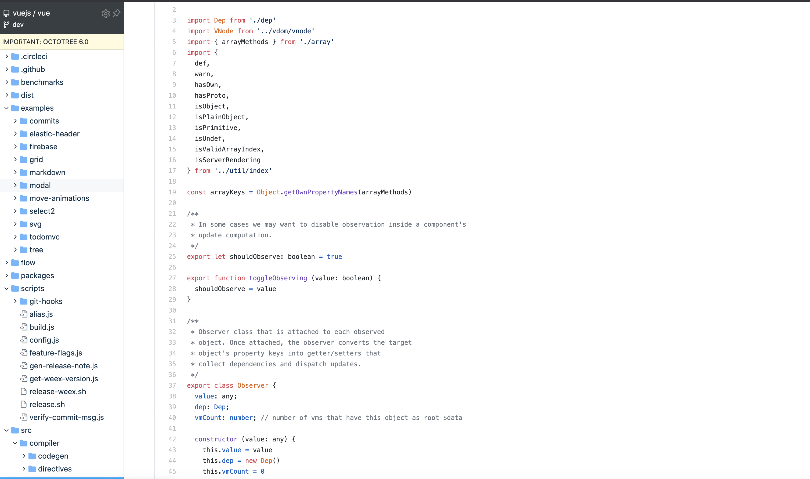

## 前言

> 总结一下能提高工作学习效率的小工具，起因是偶然阅读到一篇微信公众号发出的文章，里面是github网站的截图，浏览器左边是项目目录，很方便定位文件位置，我惊讶于自己为什么这么晚才知道有这种好东西，于是萌生了汇总工具的想法，之后谁想要找什么工具我可以直接丢这篇给他。

## Octotree（github阅读源码必备工具之一）

这个工具是chrome浏览器的一款插件，可以根据浏览器左侧的目录树很容易定位到对应文件，直接挂梯子去谷歌商店搜索`Octotree`即可

## Astar (科学上网工具)

开发的时候经常需要搜索，我现在已经不满足于百度搜索了，百度搜索出来的好多csdn复制粘贴的内容，关键词定位比较弱，相反，谷歌搜索出来的比较称心，所以经常需要科学上网，`Astar`也是chrome浏览器的一款免费插件，直接去谷歌商店搜索即可。

