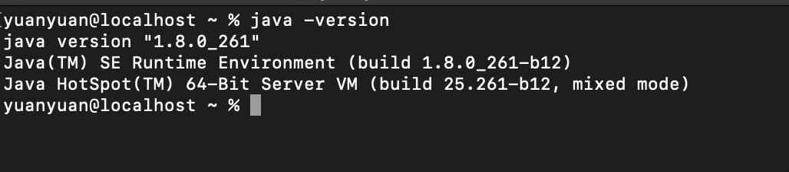

## 开发环境

`macOS`：xCode，jdk1.8

## 安装jdk1.8

1. 在官网安装(需要注册一个Oracle账号，账号密码记在了oneNote里面)，安装位置如下图：

2. 安装完成之后可以在终端执行命令`java -version`检查是否安装成功，以及查看其版本：

3. 接下来需要配置环境变量了！在Mac系统下配置环境变量是在`.bash_profile`文件里面进行的，如果文件不存在的话需要新建一个，涉及到的命令如下：

    > `open .bash_profile`: 打开文件
    >
    > `touch .bash_profile`: 新建文件
    >
    > `ls -a`: 查看全部文件，包括隐藏文件
    
    
4. 打开文件之后输入以下命令保存即可：
    ```
    # jdk
    export JAVA_HOME=/Library/Java/JavaVirtualMachines/jdk1.8.0_261.jdk/Contents/Home
    ```
5. 在terminal(终端)中输入`source .bash_profile`,刷新配置，使之生效,之后检查配置文件是否生效(`Java -version`)
    
## 常用命令
`which java`: 找java的安装路径

`whereis java`: 找java的安装路径

`echo $JAVA_HOME`:查看JAVA_HOME

`open .bash_profile`: 打开文件

`touch .bash_profile`: 新建文件

`ls -a`: 查看全部文件，包括隐藏文件


## homebrew
根据[react native中文网](https://reactnative.cn/docs/getting-started.html) 的环境搭建指南，macOS环境需要安装Node、Watchman、Xcode 和 CocoaPods，我还需要安装`Watchman`和 `CocoaPods`。
所以需要先安装homebrew。
直接点击这个[homebrew](https://brew.sh/) 进入官网，复制命令安装即可(最好开着vpn安装)

安装过程遇到了下面这个问题
```
error: RPC failed; curl 56 LibreSSL SSL_read: SSL_ERROR_SYSCALL, errno 60
fatal: the remote end hung up unexpectedly
fatal: early EOF
fatal: index-pack failed
Failed during: git fetch origin --force
```
谷歌搜索找到的答案是需要配置一下:

```
git config --global http.postBuffer 1048576000 # 这里的数字是字节数 
# 这里给的是 1000MB 也就是1000 * 1024 * 1024
# 可以根据自己的需求更改数值

# 修改完毕后 可以通过以下命令查看postBuffer
git config --list
```