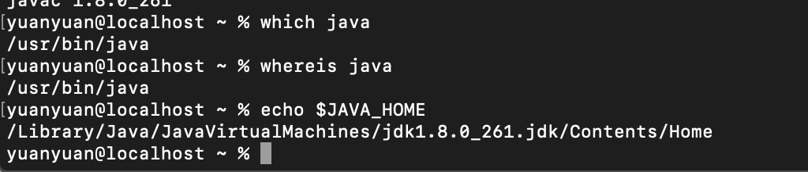

## 开发环境

`macOS`：xCode，jdk1.8

## 安装jdk1.8

1. 在官网安装(需要注册一个Oracle账号，账号密码记在了oneNote里面)，安装位置如下图：

2. 安装完成之后可以在终端执行命令`java -version`检查是否安装成功，以及查看其版本：

3. 接下来需要配置环境变量了！在Mac系统下配置环境变量是在`.bash_profile`文件里面进行的，如果文件不存在的话需要新建一个，涉及到的命令如下：

    > `open .bash_profile`: 打开文件
    >
    > `touch .bash_profile`: 新建文件
    >
    > `ls -a`: 查看全部文件，包括隐藏文件
    
    
4. 打开文件之后输入以下命令保存即可：
    ```
    # jdk
    export JAVA_HOME=/Library/Java/JavaVirtualMachines/jdk1.8.0_261.jdk/Contents/Home
    ```
5. 在terminal(终端)中输入`source .bash_profile`,刷新配置，使之生效,之后检查配置文件是否生效(`Java -version`)
    
## 常用命令
`which java`: 找java的安装路径

`whereis java`: 找java的安装路径

`echo $JAVA_HOME`:查看JAVA_HOME

`open .bash_profile`: 打开文件

`touch .bash_profile`: 新建文件

`ls -a`: 查看全部文件，包括隐藏文件

